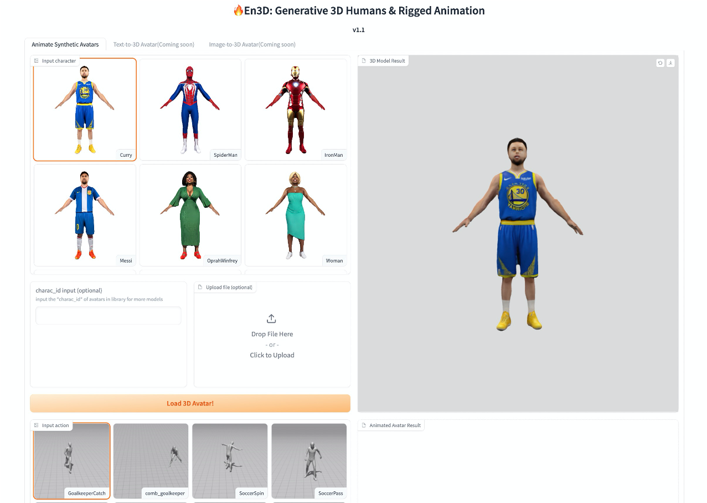

# En3D - Official PyTorch Implementation

### [Project page](https://menyifang.github.io/projects/En3D/index.html) | [Paper](https://arxiv.org/abs/2401.01173) | [Video](https://www.youtube.com/watch?v=YxMjaKgGdCc&t=5s) | [Online Demo](https://modelscope.cn/studios/alibaba_openvision_3dgen/En3D/summary)

**En3D: An Enhanced Generative Model for Sculpting 3D Humans from 2D Synthetic Data**<br>
[Yifang Men](https://menyifang.github.io/), 
[Biwen Lei](mailto:biwen.lbw@alibaba-inc.com), 
[Yuan Yao](mailto:yaoy92@gmail.com), 
[Miaomiao Cui](mailto:miaomiao.cmm@alibaba-inc.com),
[Zhouhui Lian](https://www.icst.pku.edu.cn/zlian/),
[Xuansong Xie](https://scholar.google.com/citations?user=M0Ei1zkAAAAJ&hl=en)<br>

En3D is a large 3D human generative model trained on millions of synthetic 2D data, independently of any pre-existing 3D or 2D assets. 
This repo contains an implementation of En3D and provides a series of applications built upon it. In addition, this repo aims to be a useful creative tool to produce realistic 3D avatars from seeds, text prompts or images, and support automatic character animation FBX production. 
All outputs are compatible with the modern graphics workflows. 


**Generative 3D humans**<br> 

https://github.com/menyifang/En3D/assets/47292223/8b57a74d-6270-4b37-ae1e-ee2c0baad51d


**Text guided synthesis**<br> 


**Image guided synthesis**<br> 


More results can be found in [project page](https://menyifang.github.io/projects/En3D/index.html).


## Updates
(2023-01-15) ModelScope and HuggingFace Online demo is available! Try out [](https://modelscope.cn/studios/alibaba_openvision_3dgen/En3D/summary) [](https://huggingface.co/spaces/menyifang/En3D). 

(2023-01-15) A Rigged & Animated 3D Human library (3DHuman-Syn) is released, containing ~1000 avatars produced by En3D for quick experience. Infinite avatars and actions support will be coming soon!

(2023-01-03) The paper and video are released.


## Web Demo

- Integrated an online demo into [ModelScope](https://modelscope.cn/studios/alibaba_openvision_3dgen/En3D/summary). Try out and have fun!

- Integrated an online demo into [Huggingface Spaces 🤗](https://huggingface.co/spaces/menyifang/En3D). Try out and have fun!


## Installation
```bash
conda create -n en3d python=3.8
conda activate en3d
pip install -r requirements.txt
```

## Quick Start

### WebUI usage
[Recommended] A deployed [Online Demo](https://modelscope.cn/studios/alibaba_openvision_3dgen/En3D/summary)




With own machine, you can also deploy our demo as below, which provides flexible user interface. Both CPU/GPU are supported for avatar render and animation, only GPU (>24G memory) is supported for avatar generation.

```bash
python app.py
```

### Synthetic avatar library

We released a Rigged & Animated 3D Human library (3DHuman-Syn), containing ~1000 characters produced by En3D, and 1000+ actions are provided for animation.

- Avatar download and rendering
```bash
python render.py
```

- Avatar animation
```bash
python animation.py
```


- AR application <a href="https://3d-studio123.github.io/"></a> 


Convert the generated animation file (.glb) to .usdz format using Sketchfab (upload glb and download usdz) or other tools, and insert the animated avatar to web with [model-viewer](https://modelviewer.dev/).

```bash
<!-- Import the component -->
<script type="module" src="https://ajax.googleapis.com/ajax/libs/model-viewer/3.3.0/model-viewer.min.js"></script>

<!-- Use it like any other HTML element -->
<model-viewer src="assets/human.glb" camera-controls ar shadow-intensity="1" ios-src="assets/human.usdz"></model-viewer>

```
AR function is only supported with iPhone, try the [AR example](https://3d-studio123.github.io/) in the phone browser and click the right-down icon for AR experience.


## Avatar Generation


## Training Your Own Model


## Citation

If you find this code useful for your research, please use the following BibTeX entry.

```bibtex
@inproceedings{men2024en3d,
  title={En3D: An Enhanced Generative Model for Sculpting 3D Humans from 2D Synthetic Data},
  author={Men, Yifang and Lei, Biwen and Yao, Yuan and Cui, Miaomiao and Lian, Zhouhui and Xie, Xuansong},
  journal={arXiv preprint arXiv:2401.01173},
  website={https://menyifang.github.io/projects/En3D/index.html},
  year={2024}}
```
