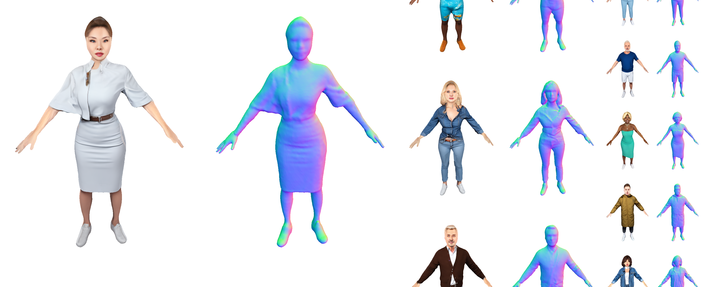

# En3D - Official PyTorch Implementation

### [Project page](https://menyifang.github.io/projects/En3D/index.html) |  [Video](https://www.youtube.com/*****) | [Paper](https://arxiv.org/abs/coming_soon) | [Online Demo](****)

**En3D: An Enhanced Generative Model for Sculpting 3D Humans from 2D Synthetic Data**<br>
[Yifang Men](https://menyifang.github.io/), 
[Biwen Lei](mailto:biwen.lbw@alibaba-inc.com), 
[Yuan Yao](mailto:yaoy92@gmail.com), 
[Miaomiao Cui](mailto:miaomiao.cmm@alibaba-inc.com) 
[Zhouhui Lian](https://www.icst.pku.edu.cn/zlian/) 
[Xuansong Xie](https://scholar.google.com/citations?user=M0Ei1zkAAAAJ&hl=en)<br>

[](https:***)
[](https://huggingface.co/spaces/***/****)

En3D is a large 3D human generative model trained on millions of synthetic 2D data, independently of any pre-existing 3D or 2D assets. 
This repo contains an implementation of En3D and provides a series of applications built upon it.

In addition, this repo aims to be a useful creative tool to produce realistic 3D avatars from seeds, text prompts or images. These generated avatars can be seamlessly animated and compatible with the modern graphics workflows. Here, We will also release a large-scale synthetic 3D human library and an action library for quick experience.


## Demo

Generative 3D humans



Text guided synthesis


Image guided synthesis


More results can be found in [project page](https://menyifang.github.io/projects/En3D/index.html).


## Updates
(2023-12-20) The project page is available now at website(https://menyifang.github.io/projects/En3D/index.html).


## Citation

If you find this code useful for your research, please use the following BibTeX entry.

```bibtex
@inproceedings{men2023en3d,
  title={En3D: An Enhanced Generative Model for Sculpting 3D Humans from 2D Synthetic Data},
  author={Men, Yifang and Lei, Biwen and Yao, Yuan and Cui, Miaomiao and Lian, Zhouhui and Xie, Xuansong},
  journal={arXiv preprint arXiv:***.***},
  website={https://menyifang.github.io/projects/En3D/index.html},
  year={2023}}
```
